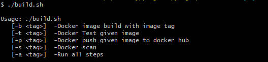
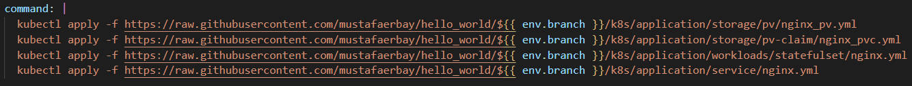
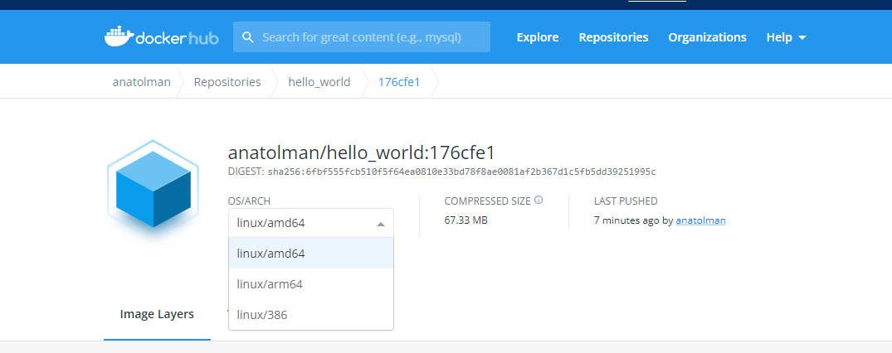
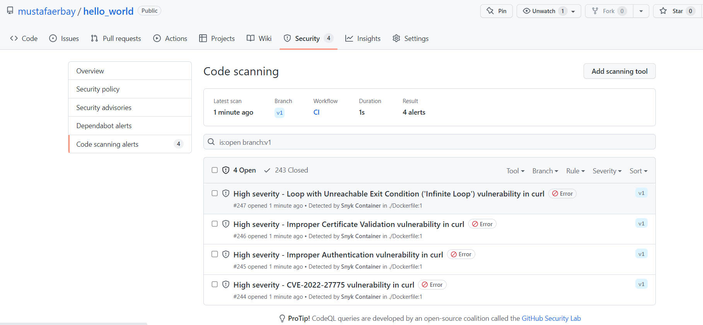
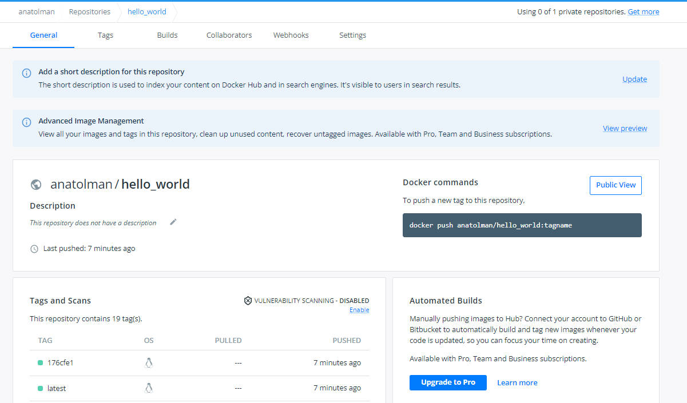
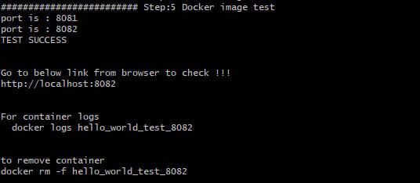

# Hello-World 

Serve static html file with nginx


## Features

- Build and test container locally with build.sh

- k8s deployment

- Manually control check for deployment 

- Cross platform image build with buildx

- Scan container image vulnerabilities with synk. [High severity vulnerability results](https://github.com/mustafaerbay/hello_world/security/code-scanning)

- Docker Hub repository [url](https://hub.docker.com/repository/docker/anatolman/hello_world)


## Deployment

To deploy this project run [ci.yml](https://github.com/mustafaerbay/hello_world/actions/workflows/ci.yml) from actions and admin approval needs for deployment from open [issues example](https://github.com/mustafaerbay/hello_world/issues/11).


## Usage/Examples for local development

```bash
./build.sh -b <tag> # build image locally with given tag
./build.sh -t <tag> # Test image locally
./build.sh -p <tag> # Push image to the public image registry
./build.sh -s <tag> # Scan image for vulnerabilities
./build.sh -a <tag> # Run all steps
```


## Run Locally

Clone the project

```bash
  git clone https://github.com/mustafaerbay/hello_world.git
```

Go to the project directory

```bash
  cd hello_world
```

Run build.sh script

```bash
  ./build.sh -a local
```



Go to the browser

```bash
  http://localhost:8080
```


## Roadmap

- Add functionality for different environment deployment

## Screenshots


